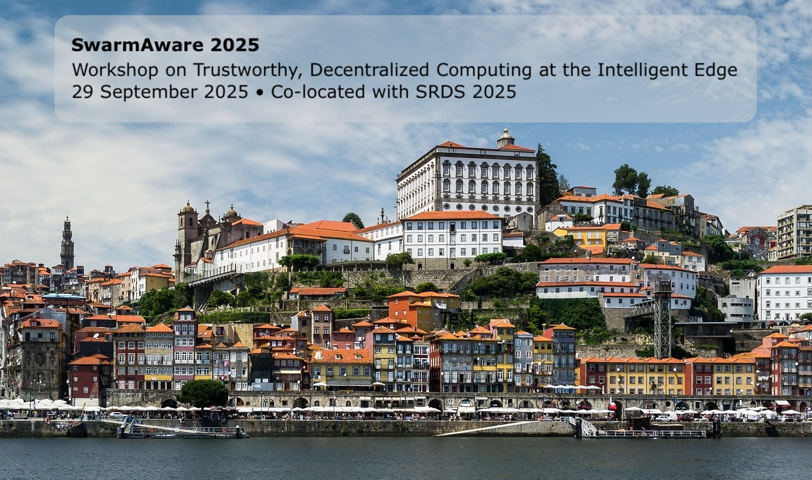

  
  

    <h1 style="font-size: 3rem; margin: 0; padding: 0.25em 0.5em; background: rgba(0,0,0,0.45); border-radius: 0.5em;">
      SwarmAware&nbsp;2025
    </h1>
    

      Workshop on Trustworthy, Decentralized Computing at the Intelligent Edge 
      29&nbsp;September 2025 • Co‑located with SRDS 2025
    

  

# SwarmAware 2025

*Trustworthy, Decentralized Computing at the Intelligent Edge*  
Workshop • **29 September 2025** • Co‑located with **SRDS 2025**

[Jump to **Call for Papers »**](#scope--call-for-papers)

---

## Table of Contents

1. [Important Dates](#important-dates)  
2. [Scope & Call for Papers](#scope--call-for-papers)  
3. [Submission Guidelines](#submission-guidelines)  
4. [Organizing Committee](#organizing-committee)  
5. [Program Committee](#program-committee)

---

## Important Dates

| Deadline | Date |
| --- | --- |
| **Paper Submission** | 21 July 2025 |
| **Notification to Authors** | 11 August 2025 |
| **Camera‑Ready & Registration** | 7 July 2025* |
| **Workshop** | 29 September 2025 |

* aligns with the SRDS main‑conference deadline

---

## Scope & Call for Papers

Today’s data‑centric distributed systems are evolving into large‑scale, highly heterogeneous **edge swarms** that must operate autonomously, preserve data sovereignty, and be demonstrably trustworthy. **SwarmAware** brings together researchers and practitioners exploring new programming paradigms, middleware, verification techniques, and real‑world deployments that make decentralized, adaptive edge intelligence safe and reliable.

### Topics of interest include (but are not limited to)

- Trust and explainability in swarm intelligence
- Formal methods for decentralized systems
- Edge/IoT orchestration and federation
- Self‑adaptive and self‑healing architectures
- Swarm learning, federated learning, and collective perception
- Blockchain & DLT for trustworthy autonomy
- Testbeds, benchmarks, and real‑world case studies

---

## Submission Guidelines

We welcome:

- **Regular research papers** — *up to 8 pages*
- **Position / vision papers** — *up to 4 pages*

Both categories should follow the standard **ACM sigconf** format, be **anonymous**, and will undergo **double‑blind** review by at least three experts.

- Submit PDFs via **EasyChair** → <https://easychair.org/conferences/?conf=swarmaware2025>
- Accepted papers will be published in the **ACM Digital Library**
- *At least one author of each accepted paper must register and present in person or remotely*

---

## Organizing Committee

### Workshop Co‑Chairs

| Name | Affiliation | Contact |
| --- | --- | --- |
| **Vrettos Moulos** | Arηs Group – ARHS (part of Accenture), Greece | [Email](mailto:Vrettos.Moulos@arhs-dev-hellas.com) |
| **Carla Ferreira** | NOVA University Lisbon, Portugal | [Email](mailto:carla.ferreira@fct.unl.pt) · [Website](http://www-ctp.di.fct.unl.pt/~cf/) |
| **Akis Kourtis** | NCSR Demokritos, Greece | [Email](mailto:akis.kourtis@iit.demokritos.gr) |

---

## Program Committee *(confirmed so far)*

- João Leitão — NOVA University Lisbon, Portugal
- Miloš Simić — University of Novi Sad, Serbia
- Akis Kourtis — NCSR "Demokritos", Greece
- George Xilouris — NCSR "Demokritos", Greece
- Giorgia Azzurra Marson — NEC Laboratories Europe, Switzerland
- George Alexandridis — National & Kapodistrian University of Athens, Greece
- Wouter Tavernier — imec, Belgium
- Achilleas Marinakis — OTE Group, Greece
- George Kousiouris — Harokopio University of Athens, Greece
- George Manias — Tilburg University, Netherlands
- Kristina Livitckaia — CERTH, Greece
- Shahab Heshmati Alamdari — Aalborg University, Denmark
- Alexandros Nizamis — CERTH, Greece
- Anna Gatzioura — Universitat Pompeu Fabra, Spain
- Efstathios Skarlatos — KEMEA, Greece

> *More PC members will be announced as they confirm.*

---

© 2025 SwarmAware Workshop Committee — part of the **25th International Symposium on Reliable Distributed Systems (SRDS 2025)**

